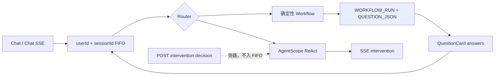

# AI Agent Station 架构

## 执行与恢复边界

普通聊天和 Workflow 回答都进入同一个有界 FIFO。QuestionCard 回答进入队列后由 `runId + questionId + checkpointId + expectedVersion + answers` 校验并恢复；`WORKFLOW_RUN` 与追加式 `WORKFLOW_RUN_EVENT` 是事实来源。订单缺参、退款原因、退款确认都使用相同 QuestionCard，且只有该显式 answers 协议可以恢复运行。

Workflow 状态只有 `RUNNING / WAITING_USER_INPUT / COMPLETED / REJECTED / FAILED / CANCELLED`。任何等待问题必须持久化 `QUESTION_JSON`；恢复时校验用户、Session、问题、检查点和乐观锁。Workflow 不经过工具权限系统，也不产生 HITL。

## ReAct HITL

ReAct 只负责复杂只读兜底。AgentScope 工具按自身声明返回 `allow / ask / deny`；`ask` 会产生 `RequireUserConfirmEvent`，服务端将其转成同一 SSE 连接上的 `intervention` 事件。客户端调用 `POST /api/v1/agent/requests/{requestId}/interventions/{replyId}` 提交 `CONFIRM` 或 `REJECT`，该调用直接投递给活跃 ReAct，不进入 FIFO，避免等待中的请求与自身决策互锁。

服务端核对 `requestId + userId + sessionId + replyId + toolCallIds` 后，使用 AgentScope `ConfirmResult` 和 `Msg.METADATA_CONFIRM_RESULTS` 在同一 `RuntimeContext` 继续当前回合。同步 `/chat` 遇到 `ask` 返回 `REACT_CONFIRM_REQUIRES_STREAM`。这是工具授权而非工作流恢复：每一轮 ReAct 使用 `InMemoryAgentStateStore`，在结束、超时或取消后删除状态，不提供断线恢复。

关键写入（支付、退款、发货、删除、账号变更）由确定性 Workflow 处理。生产 ReAct 登记近期订单、订单快照、物流、售后状态、售后规则五个只读工具，以及一个固定 `ASK` 的 `save_session_preference`：它只能写入当前会话中可编辑、可软删除的回答偏好。测试可使用 `acceptance` Profile 的可逆探针验证确认协议；它不属于生产功能。

## 提示词与框架校验：Router Policy 与 AgentSkill

Router 先运行 Core 的确定性规则；仅规则未覆盖的开放问题才使用 Spring AI 结构化输出与 `validateSchema`。classpath `prompt/agent-router-policy.md` 是 Router 的可信决策说明：只列固定 executor、domain、operation 白名单和冲突优先级，资源缺失或空白时应用启动失败。它不是 AgentScope Skill，也不包含 Tool 调用配方或退款资格、金额、时限等业务规则。

ReAct 通过只读 `ClasspathSkillRepository("agentscope/skills")` 注册唯一的 `agent-station-business-orchestration` AgentSkill。Skill 指导模型加载后怎样选择当前用户的只读 Tool、何时停止和怎样处理低风险会话偏好 `ASK`；它不激活 ToolGroup、不隐藏 Tool，也不能突破 Tool schema、权限、RuntimeContext 用户隔离或 Workflow。Skill 未加载、内容过时或模型选择错误时，以这些代码边界和实时结果为准。`load_skill_through_path` 仍作为普通 Tool 生命周期事件出现在 SSE，但 Skill 正文和原始 Tool 结果不写入 API 或日志。

AgentScope 的 typed events、工具 schema、权限和运行时上下文约束 ReAct。Thinking 可用于模型内部推理，但 `AgentScopeEventAssembler` 只发送生命周期进度，不发送原始 Thinking 到 API、SSE 或日志。

## 会话记忆

会话记忆是独立的 MySQL 层：`AGENT_MEMORY_SOURCE`、`AGENT_MEMORY_ENTRY`、`AGENT_MEMORY_EVIDENCE`，以 `userId + sessionId` 严格隔离。生成与使用独立控制，默认均关闭；旧记录开关仅兼容映射到生成。成功的 ReAct 或完成的 Workflow 在后台由 Qwen Flash 结构化提取，按会话 30 秒合并并通过独立有界执行器提交。它是 best-effort：提取失败、队列满或进程重启不会影响当前用户响应，也不会持久化任务队列。

条目仅允许 `PREFERENCE` 与 `TASK_CONTEXT` 的受控键，保存类别、键、值、来源、置信度、TTL 和请求级证据。自动任务上下文默认 24 小时过期；人工编辑优先，tombstone 阻止自动复活。检索排除已删除、过期和 legacy 条目；不引入向量库。ReAct 最多接收 8 条、4000 字符且显式标注为不可信的历史上下文，订单/退款事实仍必须实时查询；Router 不读取记忆。Workflow 只以置信度不低于 `0.90` 的任务上下文构造持久化 QuestionCard 建议，用户提交 answers 后才可成为参数。

设计参考 Codex 的生成/使用分离和可编辑记忆，以及 Claude Code 的受控项目记忆：强约束仍放在代码和 `AGENTS.md`，记忆不是事实来源或指令来源。[OpenAI Codex Memories](https://learn.chatgpt.com/docs/customization/memories) 的本地可控原则与本项目的管理 API、证据审计相匹配。跨会话、跨用户、向量检索和生产 ReAct 写工具均不在本期范围。

## 模块边界

- `core`：路由、队列、QuestionCard、Workflow、记忆和 ReAct 端口；不依赖 Spring、MyBatis 或 AgentScope。
- `infrastructure`：AgentScope、MyBatis、Session、订单、物流、售后申请与退款适配器。
- `app`：Bean 装配、HTTP/SSE DTO、异常边界和配置。

详细约定以根目录 [AGENTS.md](../AGENTS.md) 为准。
